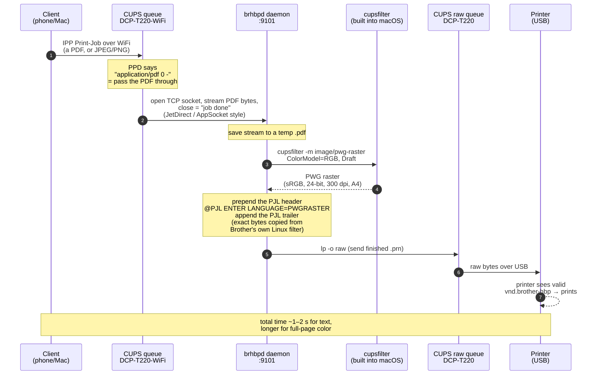
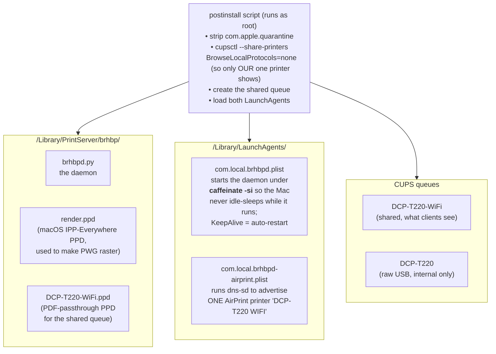

# brother-t220-wifi

Turn one Mac into a **WiFi / AirPrint print server** for the **Brother
DCP-T220** — a cheap USB-only ink-tank printer with no wireless and no macOS
driver. After you install this, every iPhone, iPad, Android phone, and other
Mac on the same WiFi can print to the DCP-T220 as if it were a normal network
printer. No Docker, no Brother app, no cloud.

One Mac stays plugged into the printer by USB and acts as the server. Everyone
else prints over WiFi.

---

## Background: normally this printer needs Brother iPrint&Scan

Out of the box, the DCP-T220 can only be driven by **Brother's own iPrint&Scan
application**. That app talks to the printer over USB using Brother's private
protocol; there is no standard macOS/Windows print driver for this model. So on
a plain setup, the *only* supported way to print is:

- install Brother iPrint&Scan on the computer that has the USB cable, and
- open that app every time you want to print (it renders the page itself).

That is exactly the limitation this project removes — but if you just want the
official app, here is where to get it:

- **macOS** — Mac App Store: <https://apps.apple.com/us/app/brother-iprint-scan/id1193539993?mt=12>
- **Windows / Mac (download hub)** — Brother's software page:
  <https://www.brother.com/apps/ps/en/>
- **Step-by-step (Windows or Mac)** —
  <https://help.brother-usa.com/app/answers/detail/a_id/174288/>

This project reuses the fact that iPrint&Scan works over USB, but replaces the
app entirely with a tiny always-on server so that **any** device can print over
WiFi without installing Brother software.

> **Platform note — macOS only.** This tool is built on macOS-specific pieces:
> `cupsfilter`, `dns-sd` (Bonjour), CUPS sharing, LaunchAgents, and `pkgbuild`.
> It will **not** run on Windows as-is. The *technique* is portable, though — a
> Windows version would need to reproduce the same idea (see
> [the byte pipeline](#the-exact-byte-pipeline-this-is-the-clever-part)):
> take a PDF, rasterize it to PWG, wrap it in the `@PJL ENTER LANGUAGE=PWGRASTER`
> envelope, and send it to the printer's USB port, then expose that over the
> network (e.g. via a shared Windows printer or Bonjour Print Services). If you
> want Windows support, you'd have to build that yourself based on this design.

---

## Why this is not trivial

The DCP-T220 is a stubborn little printer, and every "normal" path to print
from a phone is a dead end. Here is what actually happens, and why the obvious
solutions fail:

```mermaid
flowchart TD
    phone["Phone / tablet / other Mac<br/>wants to print over WiFi"]

    subgraph deadends["The paths that DO NOT work"]
        direction TB
        wifi["Print straight to the printer's WiFi?<br/><b>FAIL</b> — DCP-T220 has no WiFi at all,<br/>USB is the only port"]
        drv["Use a Brother macOS driver?<br/><b>FAIL</b> — Brother ships no CUPS<br/>driver for macOS for this model"]
        bridge["Use Brother's iPrint&amp;Scan bridge<br/>(HttpToUsb, the tunnel it installs)?<br/><b>FAIL</b> — its IPP endpoint answers<br/>Print-Job with a <i>fake</i> success:<br/>HTTP 200, no job-id, nothing prints.<br/>Proven by packet capture."]
    end

    phone --> wifi
    phone --> drv
    phone --> bridge

    key["The one real fact we can build on:<br/>the printer only understands Brother's<br/>own page format <b>vnd.brother-hbp</b>,<br/>and the PJL/PWG envelope inside it"]

    wifi -.-> key
    drv -.-> key
    bridge -.-> key

    style deadends fill:#3a1f1f,stroke:#a33
    style key fill:#1f3a1f,stroke:#3a3
```



The breakthrough: we discovered (by reverse-engineering the output of Brother's
*Linux* driver) that the printer accepts a **PWG raster** image wrapped in a
specific **PJL** text header. macOS can already produce PWG raster natively with
its built-in `cupsfilter`. So we build that exact byte stream ourselves and push
it straight down the USB cable. No Brother software runs at all.

---

## How it works

Two views: the big picture, then the exact byte pipeline.

### Big picture

```mermaid
flowchart LR
    subgraph clients["Any device on the WiFi"]
        ios["iPhone / iPad<br/>(AirPrint, built in)"]
        droid["Android<br/>(Default Print / Mopria)"]
        mac2["Another Mac<br/>(adds it as a normal printer)"]
    end

    subgraph server["The server Mac (this one)"]
        direction TB
        bonjour["Bonjour advertisement<br/>'DCP-T220 WIFI'<br/>(dns-sd LaunchAgent)"]
        cups["CUPS shared queue<br/>DCP-T220-WiFi<br/>(listens on :631)"]
        daemon["brhbpd daemon<br/>(listens on 127.0.0.1:9101)<br/>runs forever, never sleeps"]
        usbq["CUPS raw queue<br/>DCP-T220 → usb://"]
    end

    printer["Brother DCP-T220<br/>(USB cable)"]

    ios & droid & mac2 -->|"1. find printer"| bonjour
    ios & droid & mac2 -->|"2. send job (PDF/JPEG)"| cups
    cups -->|"3. stream over TCP"| daemon
    daemon -->|"6. raw bytes"| usbq
    usbq -->|"7. USB"| printer

    style server fill:#16233a,stroke:#38a
    style clients fill:#1c2a1c,stroke:#4a4
```



### The exact byte pipeline (this is the clever part)



Plain-English summary of the trick:

1. The phone sends an ordinary **PDF** (that is what AirPrint does).
2. Our CUPS queue does not try to "drive" the printer. Its only job is to hand
   the raw PDF to our daemon over a plain TCP socket.
3. The daemon uses macOS's **own** `cupsfilter` to turn the PDF into **PWG
   raster** — a standard bitmap format Apple already supports.
4. The daemon wraps that bitmap in the short **PJL** text header the DCP-T220
   insists on (`@PJL ENTER LANGUAGE=PWGRASTER`). Those exact header/trailer
   bytes were lifted from the output of Brother's Linux driver, so the printer
   can't tell the difference.
5. The daemon sends the finished bytes to a second, raw CUPS queue that just
   pipes them down the USB cable.

That is the whole system. No container, no proprietary binary running — just
Apple's built-in tools plus ~120 lines of Python.

---

## What gets installed

Everything lives in two places and starts automatically at every login.



Design choices worth knowing:

- **Never idle / always ready.** The daemon is launched by `caffeinate -si`,
  which keeps the Mac from going to idle sleep while the server is up. Combined
  with `KeepAlive`, the print server is always listening. (If the lid is closed
  on battery the Mac can still sleep; keep it plugged in for a true always-on
  server.)
- **Exactly one printer on the network.** We turn off CUPS's own Bonjour
  broadcasting (`BrowseLocalProtocols=none`) and advertise a single, clean
  AirPrint record ourselves, so users don't see three near-identical printers.
- **Self-healing USB queue.** If the printer is unplugged during install, the
  daemon creates the raw `usb://` queue automatically the first time it sees the
  printer, so install never fails just because the cable was out.
- **No secrets, no proprietary binaries in this repo.** The docker-free version
  reproduces the printer's format with Apple's tools; nothing from Brother is
  redistributed here.

---

## Install

1. Download `DCP-T220-WiFi-Installer.dmg` from the
   [Releases](../../releases) page.
2. Open the DMG and **double-click the `.pkg`**.
3. Click through the installer and enter your Mac password when asked.

That's it. The installer strips Apple's quarantine flag, sets up the queues,
and starts the server immediately and at every future login.

Requirements on the **server** Mac:

- macOS (uses the built-in `python3`, `cupsfilter`, `dns-sd`).
- The DCP-T220 connected by **USB** and powered on.
- Keep this Mac awake (plugged in) so it can serve prints at any time.

Nothing needs to be installed on the phones or the other Macs.

---

## How to print

| Device | Steps |
|--------|-------|
| **iPhone / iPad** | Open anything → Share → **Print** → pick **DCP-T220 WIFI** → Print. |
| **Android** | Open a file → menu → **Print** → pick **DCP-T220 WIFI**. If it isn't listed, install **Mopria Print Service** from the Play Store, enable it, and try again. |
| **Another Mac** | System Settings → Printers & Scanners → **Add Printer** → pick **DCP-T220 WIFI** (Bonjour) → Add. |
| **The server Mac itself** | Just print to **DCP-T220 WIFI** like any printer. |

All devices must be on the **same WiFi** as the server Mac.

---

## Build it yourself

```bash
./build.sh 2.0.1      # produces DCP-T220-WiFi-Installer.dmg
```

`build.sh` uses `pkgbuild` + `productbuild` to make the double-click installer,
then `hdiutil` to wrap it in a DMG. `scripts/postinstall` is the root script
that wires everything up on the target Mac.

---

## Uninstall

```bash
sudo launchctl bootout gui/$(id -u)/com.local.brhbpd
sudo launchctl bootout gui/$(id -u)/com.local.brhbpd-airprint
sudo rm -f /Library/LaunchAgents/com.local.brhbpd*.plist
sudo rm -rf /Library/PrintServer/brhbp
lpadmin -x DCP-T220-WiFi
lpadmin -x DCP-T220
```

---

## Troubleshooting

- **Nothing prints, printer plugged in.** Check the daemon log:
  `cat ~/Library/Logs/brhbpd.log`. Each job should show `job received`,
  `converted`, and `lp rc=0`.
- **Printer not found on the phone.** Confirm both devices are on the same WiFi;
  confirm the advertisement is live: `dns-sd -B _ipp._tcp local.` should list
  `DCP-T220 WIFI`.
- **Server Mac keeps sleeping.** Keep it on power. `caffeinate -si` blocks idle
  sleep but not lid-close sleep on battery.
- **Wrong paper size.** The default is A4. Change `PageSize=A4` in the daemon's
  PJL header and in the PPD, rebuild, reinstall.

---

## How this was figured out (short version)

The Brother iPrint&Scan app *can* print over its USB bridge, so we packet-captured
what it sent. The IPP `Print-Job` calls to the bridge returned HTTP 200 but with
no job-id and produced no paper — a fake success. Meanwhile the printer's real
input format is `vnd.brother-hbp`, which is just a PJL wrapper around PWG raster.
We took the exact PJL header/trailer from Brother's Linux driver output, learned
that macOS's `cupsfilter` already emits matching PWG raster (sRGB, 24-bit, 300
dpi), and stitched the two together. The first byte-for-byte reconstruction we
sent over USB made the printer's status flip to `processing` and a page came out.
Everything above is the productized version of that finding.
